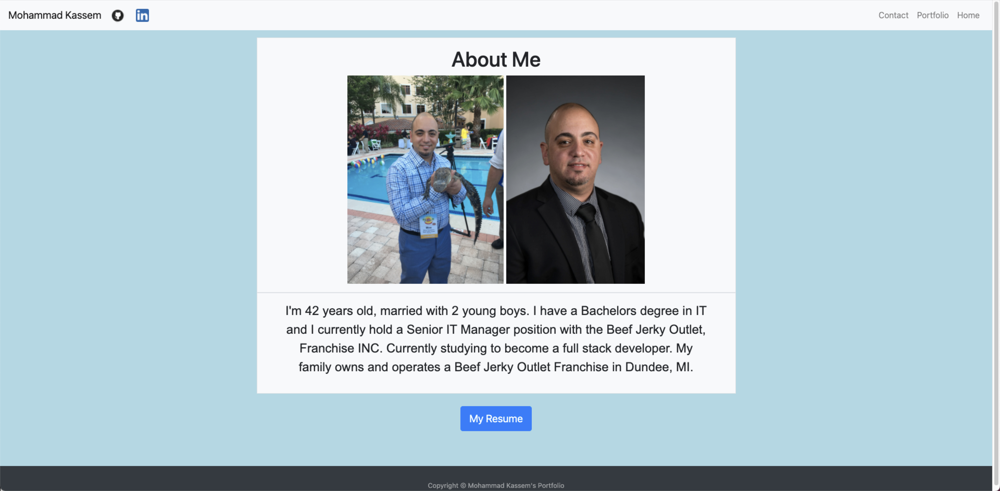
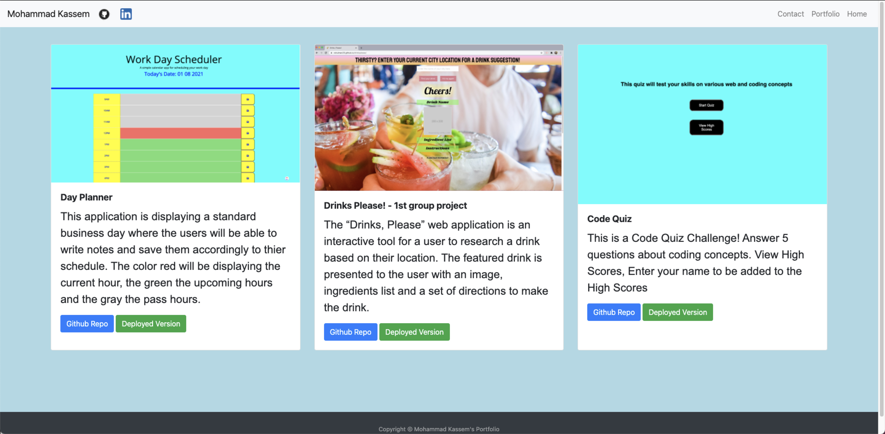
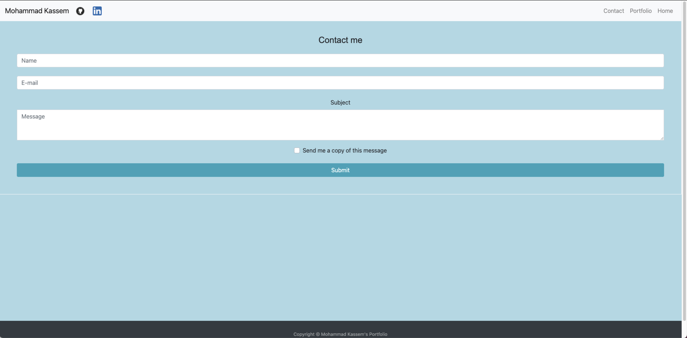

# Updated Portfolio
 

My Bootstrap Portfolio is a fully responsive portfolio website that scales to all screen sizes.

Link to deployed site:  https://mkassem917.github.io/bootstrap-portfolio-/

**Contents:**

* index.html - Contains HTML for the about me page
* contact.html - Contains HTML for the contact me page
* portfolio.html - Contains HTML for the portfolio page
* assets folder - Contains CSS Style Sheet along with images & resume.pdf
* README.md

**Tools Used:**

* Bootstrap website - Layouts (grid systems - columns and rows), Contents and Forms
* w3schools website - Footer Layout
* Iconfinder.com website for social media icons - GitHub and Linkedin icons

**Added downloadable Resume and GitHub icon with link**

