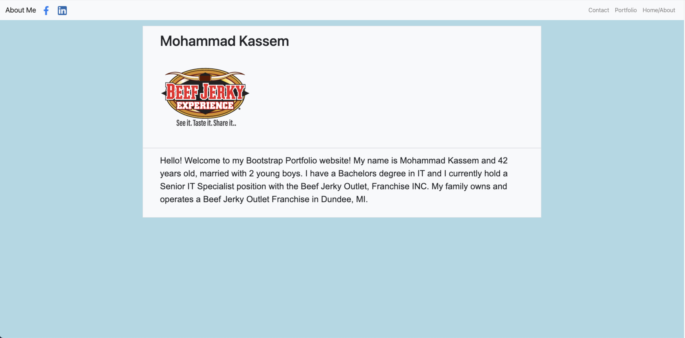
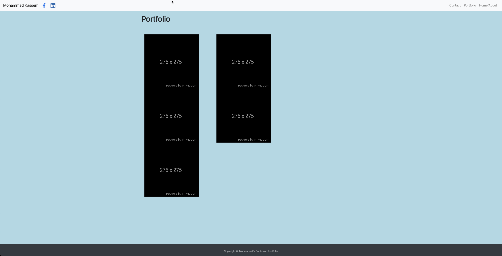
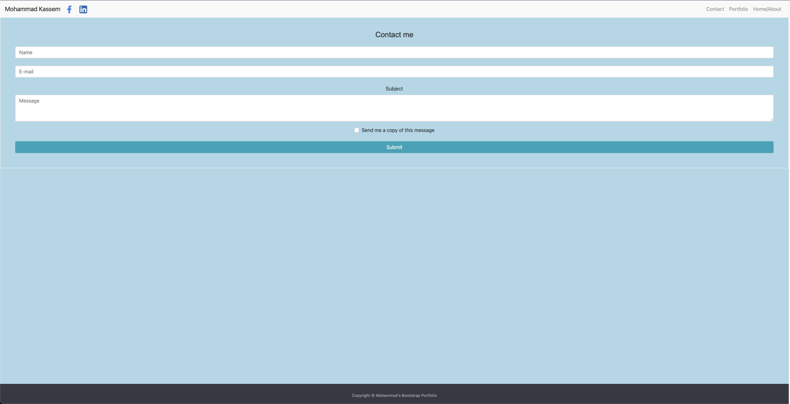

# bootstrap-portfolio-
Week 2 Homework - Bootstrap Portfolio 

My Bootstrap Portfolio is a fully responsive portfolio website that scales to all screen sizes.

**Contents:**

* index.html - Contains HTML for the about me page
* contact.html - Contains HTML for the contact me page
* portfolio.html - Contains HTML for the portfolio page
* assets folder - Contains CSS Style Sheet along with Images
* README.md

**Tools Used:**

* Bootstrap website - Layouts (grid systems - columns and rows), Contents and Forms
* w3schools website - Footer Layout
* Iconfinder.com website for social media icons - Facebook and Linkedin icons
* placeholder.com for place holder images on the portfolio page - Placeholder images
